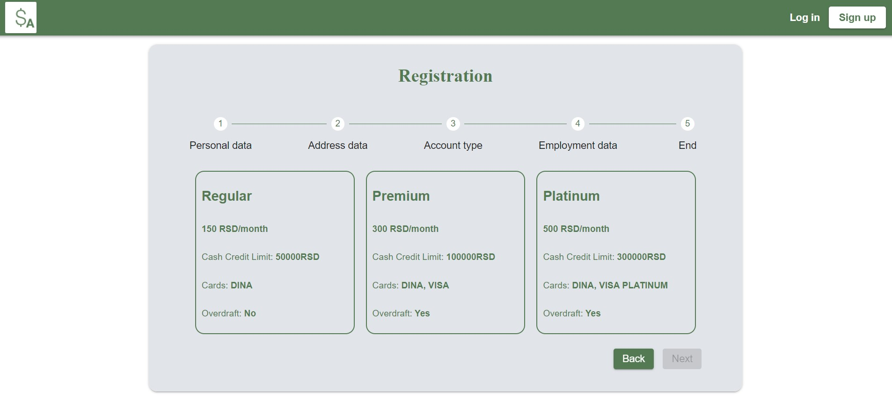
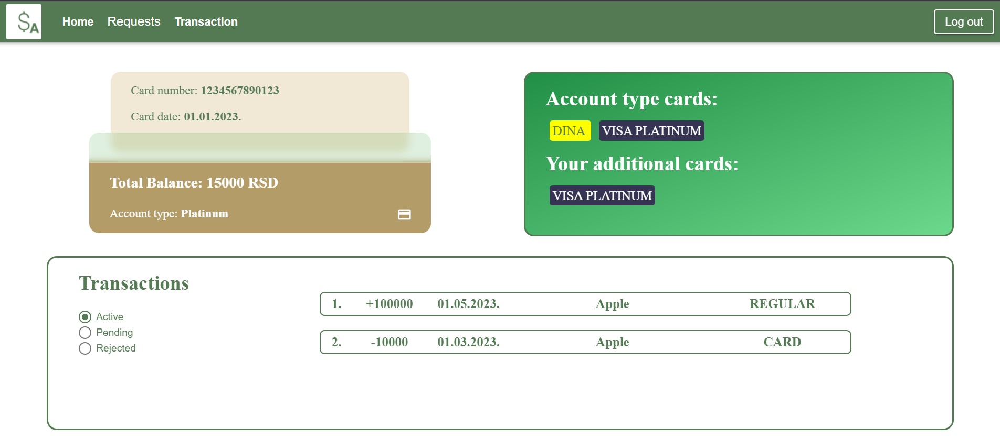
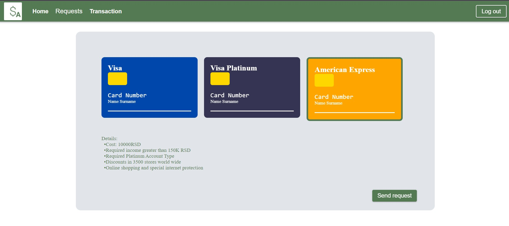
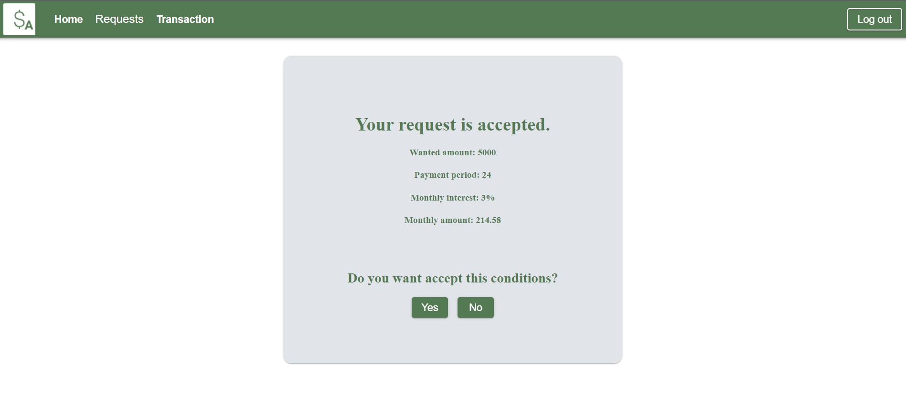
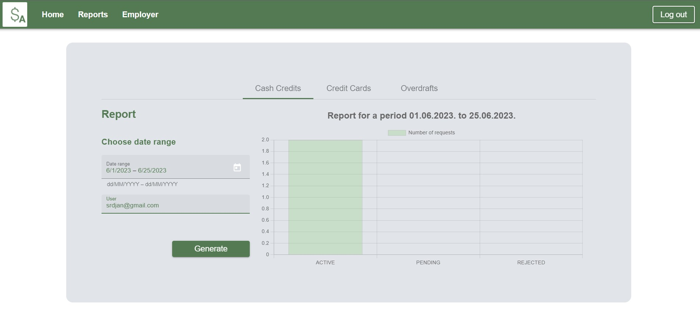

<h1 align="center">
  SA Banking System
   
</h1>

  • <a href="#-project-setup-and-commands">FTN Novi Sad, 2023</a>
  •

## 👨‍💻 Developer
    • Anastasija Samčović   SW44-2019
    • Srđan Đurić           SW63-2019

## 🚀 Project setup

#### :warning: *Pre requirements:*

- Node.js
- Angular
- JDK version 11
- PostgreSQL
- Drools plugin for InteliJ

#### :floppy_disk: *How to run backend:*

- Backend consists of three separate projects:
    - Model project(all entities and enums)
    - Kjar project(all drools rules)
    - Service project(controllers, services and repositories)
- <b>First step:</b>
    - Open Model application in InteliJ IDE
    - Click on Maven option and run <b>Clean</b>
    - After Clean run <b>Install</b>
- <b>Second step:</b>
    - Open Kjar application in InteliJ IDE
    - Click on Maven option and run <b>Clean</b>
    - After Clean run <b>Install</b>
- Open Service application and click run button

#### :floppy_disk: *How to run frontend:*

- Open front-app in wanted IDE (VSCode, WebStorm etc.)
- Run <b>npm install --force</b> in terminal to install all needed dependencies
- Run <b>ng serve</b> in terminal to start application

## 🤝 Useful to know:
- There are two types of user roles to login:
    - Admin (admin@gmail.com)
    - Client (srdjan@gmail.com)
- Password for all users is: sifra1234A2@
- <b>Note that you will need to change configuration to connect to your local PostgreSQL Database</b>

## 📱 Some photos of application

